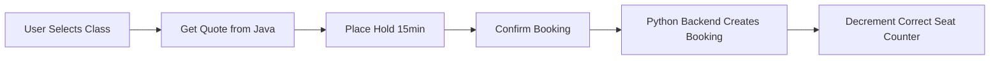

# Galaxium Travels Seat Classes - Implementation Status

## Executive Summary

**Status: ✅ FULLY IMPLEMENTED**

The three-tier seat class system (Economy, Business, and Galaxium Class) is already fully operational across all layers of the Galaxium Travels booking system. This document provides a comprehensive overview of the current implementation.

## Current Implementation

### 1. Seat Classes Overview

| Class | Price Multiplier | Seat Distribution | Features |
|-------|-----------------|-------------------|----------|
| **Economy** | 1.0x base price | 60% of total seats | Standard seating, in-flight entertainment, complimentary snacks |
| **Business** | 2.5x base price | 30% of total seats | Premium seating, priority boarding, gourmet meals, extra legroom |
| **Galaxium Class** | 5.0x base price | 10% of total seats | Luxury pods, VIP lounge access, personal concierge, zero-G experience |

### 2. Backend Implementation (Python FastAPI)

#### Database Models ([`models.py`](../booking_system_backend/models.py))
- **Flight Model**: Three separate seat counters
  - `economy_seats_available`
  - `business_seats_available`
  - `galaxium_seats_available`
- **Booking Model**: Tracks seat class and actual price paid
  - `seat_class` field (economy/business/galaxium)
  - `price_paid` field (calculated at booking time)

#### Business Logic ([`services/booking.py`](../booking_system_backend/services/booking.py))
- Price calculation using `SEAT_CLASS_MULTIPLIERS` constant
- Independent seat counter management per class
- Validation ensures correct class counter is decremented on booking
- Cancellation restores seats to the correct class counter

#### API Schemas ([`schemas.py`](../booking_system_backend/schemas.py))
- `SeatClass` type definition: `Literal['economy', 'business', 'galaxium']`
- `FlightOut` includes computed prices for all three classes
- `BookingRequest` accepts optional `seat_class` parameter (defaults to economy)

#### Flight Filtering ([`services/flight.py`](../booking_system_backend/services/flight.py))
- Supports filtering by seat class availability
- Query parameters: `has_economy`, `has_business`, `has_galaxium`
- Alternative parameter: `seat_class` for feature branch compatibility

#### Database Seeding ([`seed.py`](../booking_system_backend/seed.py))
- Automatically distributes seats: 60% economy, 30% business, 10% galaxium
- Seeds demo flights with proper seat class distribution

### 3. Frontend Implementation (React + TypeScript)

#### Type Definitions ([`types/index.ts`](../booking_system_frontend/src/types/index.ts))
- `SeatClass` type: `'economy' | 'business' | 'galaxium'`
- `Flight` interface includes all three seat availability counters
- `Flight` interface includes computed prices for all classes
- `Booking` interface tracks `seat_class` and `price_paid`

#### Flight Display ([`FlightCard.tsx`](../booking_system_frontend/src/components/flights/FlightCard.tsx))
- Visual representation of all three seat classes
- Color-coded class indicators:
  - Economy: Blue (Plane icon)
  - Business: Purple (Crown icon)
  - Galaxium: Green (Rocket icon)
- Real-time seat availability display
- Price display for each class
- Low seat warnings (≤2 seats remaining)

#### Booking Flow ([`BookingModal.tsx`](../booking_system_frontend/src/components/bookings/BookingModal.tsx))
- Three-step booking process:
  1. **Select**: Choose seat class with feature comparison
  2. **Quote**: Review pricing from inventory service
  3. **Hold**: 15-minute reservation with countdown timer
- Interactive seat class selection with visual feedback
- Feature lists for each class
- Sold-out state handling per class

### 4. Java Inventory Hold Service

#### Pricing Service ([`PricingService.java`](../inventory_hold_service/src/main/java/com/galaxium/holdservice/service/PricingService.java))
- Supports three seat classes: economy, business, first (legacy naming)
- Base prices defined in service
- Flight-specific multipliers applied

**Note**: Java service uses "first" instead of "galaxium" - this is a known naming inconsistency that doesn't affect functionality since the Python backend handles the actual booking.

## Architecture Patterns

### Independent Seat Counters
Each flight maintains three separate seat availability counters. This design ensures:
- No race conditions between different class bookings
- Accurate availability tracking per class
- Proper seat restoration on cancellation

### Price Calculation
Prices are calculated dynamically based on:
- Flight's `base_price` (economy price)
- Seat class multiplier (1.0x, 2.5x, or 5.0x)
- Stored in booking as `price_paid` for historical accuracy

### Booking Flow Integration

## Testing Coverage

### Backend Tests ([`tests/test_services.py`](../booking_system_backend/tests/test_services.py))
- Seat class validation
- Price calculation verification
- Independent counter management
- Cancellation seat restoration
- Sold-out handling per class

### REST API Tests ([`tests/test_rest.py`](../booking_system_backend/tests/test_rest.py))
- Booking with different seat classes
- Flight filtering by seat availability
- Error handling for invalid classes

## Current Limitations & Considerations

1. **Java Service Naming**: Uses "first" instead of "galaxium" (cosmetic only)
2. **No Seat Selection**: Users cannot choose specific seat numbers within a class
3. **Fixed Distribution**: 60/30/10 split is hardcoded in seed data
4. **No Dynamic Pricing**: Prices are fixed multipliers, no demand-based pricing
5. **No Class Upgrades**: No mechanism to upgrade from one class to another

## Conclusion

The seat class system is **production-ready** and fully functional. All three classes (Economy, Business, Galaxium) are:
- ✅ Properly modeled in the database
- ✅ Correctly handled in business logic
- ✅ Accurately displayed in the UI
- ✅ Integrated with the booking flow
- ✅ Tested across the stack

No implementation work is required. The system is operational and ready for use.